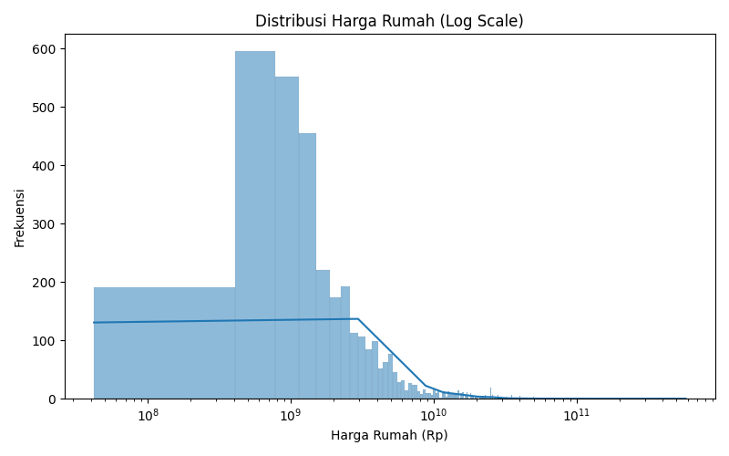
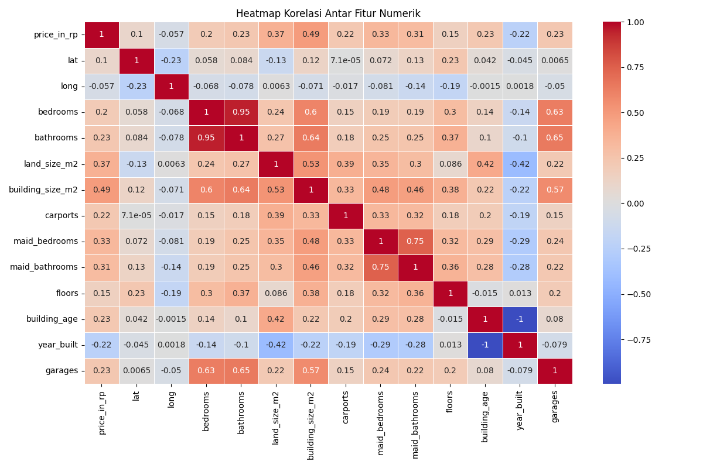
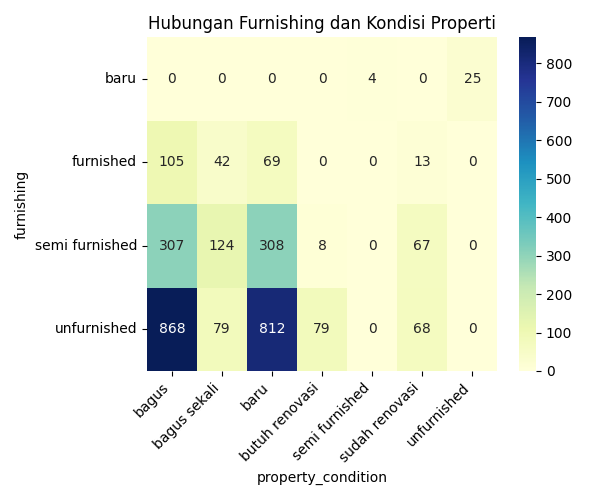

# 🏠 House Price Prediction in JABODETABEK Using Ensemble Regression

**Ensemble Regression and Feature Engineering for Urban Housing Price Estimation**

---


## 📌 1. Domain Proyek: Real Estate & Urban Socioeconomics

Permasalahan harga rumah di wilayah JABODETABEK (Jakarta, Bogor, Depok, Tangerang, dan Bekasi) terus menjadi isu strategis di tengah pertumbuhan populasi perkotaan yang pesat. Urbanisasi masif yang terjadi di kawasan ini telah mendorong peningkatan permintaan terhadap hunian, namun tidak diimbangi oleh ketersediaan lahan dan pembangunan yang memadai. Hal ini menyebabkan harga properti melonjak dan menjadikan rumah layak huni semakin sulit dijangkau oleh sebagian besar masyarakat. Data Badan Pusat Statistik (2023) mencatat adanya backlog perumahan yang mencapai lebih dari 12 juta unit, mencerminkan krisis kepemilikan rumah yang kian serius di Indonesia.

Dalam situasi ini, kemampuan untuk memprediksi harga rumah secara akurat menjadi sangat penting. Prediksi harga tidak hanya membantu calon pembeli dalam menyusun anggaran, tetapi juga mendukung pengembang dalam merancang strategi harga yang kompetitif, serta menjadi dasar bagi pengambilan keputusan investasi oleh pelaku pasar properti. Selain itu, pemerintah juga memerlukan estimasi harga yang presisi untuk merancang kebijakan subsidi dan perencanaan tata kota yang inklusif.

Penelitian dari Al Maula et al. (2025) menunjukkan bahwa tren permukiman telah bergeser ke daerah-daerah pinggiran seperti Tangerang Selatan, yang menawarkan harga lebih terjangkau namun tetap menghadirkan tantangan dalam aspek infrastruktur dan pemerataan pembangunan. Di sisi lain, studi oleh El Mouna et al. (2023) menegaskan bahwa harga rumah sangat dipengaruhi oleh berbagai faktor—termasuk ukuran, lokasi, akses terhadap fasilitas umum, dan usia bangunan—dan bahwa pendekatan *machine learning* mampu memberikan hasil prediksi yang lebih adaptif dibanding metode konvensional.

Oleh karena itu, proyek ini bertujuan untuk membangun model prediksi harga rumah di kawasan JABODETABEK dengan memanfaatkan algoritma *machine learning*, khususnya teknik *ensemble regression* seperti *Random Forest* dan *Gradient Boosting*. Model ini akan diperkuat dengan proses *feature engineering* yang bertujuan mengekstraksi informasi penting dari data historis perumahan. Pendekatan ini diharapkan mampu memberikan kontribusi nyata dalam pemetaan harga properti, pengambilan keputusan berbasis data, dan perencanaan kota yang lebih berkelanjutan.


---


## 🎯 2. Business Understanding

### 🔍 Problem Statements

1. Bagaimana memprediksi harga rumah di wilayah JABODETABEK secara akurat dengan mempertimbangkan variabel seperti ukuran bangunan, lokasi geografis, jumlah kamar, akses terhadap fasilitas umum, dan usia bangunan?
2. Algoritma *machine learning* mana yang paling efektif dalam menghasilkan prediksi harga rumah di kawasan urban Indonesia yang kompleks dan heterogen, seperti JABODETABEK?
3. Fitur apa saja yang paling berpengaruh terhadap harga rumah dan bagaimana informasi ini dapat dimanfaatkan untuk perencanaan kebijakan dan strategi investasi properti?

### 🎯 Objectives

1. Membangun model prediksi harga rumah yang akurat dan dapat diandalkan untuk mendukung pengambilan keputusan oleh pembeli, pengembang, investor, dan perencana kota.
2. Membandingkan performa beberapa algoritma *machine learning*, yaitu **Linear Regression**, **MLP Regressor**, dan **XGBoost Regressor**, dalam memodelkan harga rumah berdasarkan data properti, lengkap dengan proses **hyperparameter tuning** untuk meningkatkan performa masing-masing model.
3. Mengidentifikasi fitur-fitur yang paling berpengaruh terhadap harga rumah sebagai dasar untuk kebijakan tata ruang, subsidi perumahan, dan perencanaan investasi jangka panjang.

### 💡 Solusi

1. Menggunakan **Linear Regression** sebagai baseline model untuk memberikan interpretasi sederhana terhadap hubungan antar fitur dan harga rumah.
2. Menerapkan **MLP Regressor** (Multi-Layer Perceptron) untuk menangkap hubungan non-linear antar variabel input, serta mengoptimalkan kinerjanya melalui **hyperparameter tuning** menggunakan `RandomizedSearchCV`.
3. Mengimplementasikan **XGBoost Regressor** sebagai model utama berbasis ensemble yang kuat, juga disertai proses **hyperparameter tuning** agar mampu belajar secara adaptif terhadap kompleksitas data perumahan di JABODETABEK.


Pendekatan ini dirancang untuk menjawab tantangan pasar properti di JABODETABEK, yang ditandai oleh tekanan urbanisasi, disparitas harga antar wilayah, dan kebutuhan akan sistem pengambilan keputusan berbasis data sebagaimana disoroti dalam studi Al Maula et al. (2025) dan El Mouna et al. (2023).


---

## 📁 3. Dataset Overview

* **Sumber**: Kaggle - [Daftar Harga Rumah JABODETABEK](https://www.kaggle.com/datasets/nafisbarizki/daftar-harga-rumah-jabodetabek)
* **Jumlah entri**: 3.553 baris
* **Jumlah fitur**: 27 kolom
* **Penulis dataset**: Nafis Barizki

---

## 📋 4. Fitur Dataset

### 📋 Deskripsi Fitur

| Kolom                  | Tipe    | Deskripsi                                       |
| ---------------------- | ------- | ----------------------------------------------- |
| `url`                  | object  | Link ke iklan properti                          |
| `price_in_rp`          | float64 | Harga rumah dalam rupiah (target variable)      |
| `title`                | object  | Judul iklan                                     |
| `address`              | object  | Alamat lengkap dari rumah                       |
| `district`             | object  | Kecamatan                                       |
| `city`                 | object  | Kota atau kabupaten                             |
| `lat`, `long`          | float64 | Koordinat geografis                             |
| `facilities`           | object  | Fasilitas-fasilitas yang tersedia               |
| `property_type`        | object  | Tipe properti (e.g., rumah, apartemen)          |
| `ads_id`               | object  | ID unik iklan                                   |
| `bedrooms`             | float64 | Jumlah kamar tidur                              |
| `bathrooms`            | float64 | Jumlah kamar mandi                              |
| `land_size_m2`         | float64 | Luas tanah                                      |
| `building_size_m2`     | float64 | Luas bangunan                                   |
| `carports`             | float64 | Jumlah carport                                  |
| `certificate`          | object  | Jenis sertifikat (e.g., SHM, HGB)               |
| `electricity`          | object  | Daya listrik (misal: 2200 watt)                 |
| `maid_bedrooms`        | float64 | Jumlah kamar pembantu                           |
| `maid_bathrooms`       | float64 | Jumlah kamar mandi pembantu                     |
| `floors`               | float64 | Jumlah lantai                                   |
| `building_age`         | float64 | Umur bangunan (tahun)                           |
| `year_built`           | float64 | Tahun dibangun                                  |
| `property_condition`   | object  | Kondisi bangunan (baru, bekas, renovasi)        |
| `building_orientation` | object  | Arah bangunan (timur, barat, dsb.)              |
| `garages`              | float64 | Jumlah garasi                                   |
| `furnishing`           | object  | Kondisi furnitur (furnished, semi, atau kosong) |

---

## 🔍 5. Data Understanding

### Statistik Umum:

* Data harga sangat **skewed ke kanan**, menunjukkan adanya outlier harga rumah mewah.
* Korelasi tertinggi dengan `price_in_rp`:

  * `building_size_m2`, `land_size_m2`
  * `bedrooms`, `bathrooms`
  * `property_type` dan `furnishing` juga memberikan insight penting.

---

### 🔎 Pemeriksaan Duplikasi dan Missing Value:

#### 1. ✅ **Duplikasi Data**

```python
# Menampilkan semua baris yang sepenuhnya duplikat
duplicate_rows = data[data.duplicated(keep=False)]
print(duplicate_rows)

# Menampilkan jumlah baris duplikat (tidak termasuk baris pertama dari duplikat)
print(f"Jumlah baris duplikat (selain baris pertama): {data.duplicated().sum()}")
```

* **Hasil**:

  * Tidak ditemukan **baris duplikat** dalam dataset.
  * Jumlah baris duplikat (selain baris pertama): **0**
  * Menunjukkan bahwa data bersih dari penggandaan identik.

#### 2. 🚫 **Missing Value**

```python
data.isnull().sum()
```

| Fitur                  | Jumlah Missing |
| ---------------------- | -------------- |
| `property_type`        | 1              |
| `ads_id`               | 4              |
| `bedrooms`             | 34             |
| `bathrooms`            | 29             |
| `land_size_m2`         | 2              |
| `building_size_m2`     | 2              |
| `certificate`          | 141            |
| `floors`               | 6              |
| `building_age`         | 1445           |
| `year_built`           | 1445           |
| `property_condition`   | 246            |
| `building_orientation` | 1647           |
| `furnishing`           | 387            |

* Beberapa fitur seperti `building_age`, `year_built`, dan `building_orientation` memiliki **missing value yang cukup besar**, perlu penanganan lebih lanjut seperti imputasi atau penghapusan tergantung kontribusinya ke model.
* Fitur lain dengan jumlah missing kecil dapat ditangani dengan metode sederhana (mean, mode, atau imputasi berdasarkan grup).

---

### Visualisasi:

#### 1. 📉 **Distribusi Harga Properti**



* **Tujuan Visualisasi**: Menunjukkan distribusi nilai `price_in_rp` (harga properti) untuk memahami skala data dan potensi outlier.
* **Insight**:

  * Distribusi harga **right-skewed**, menunjukkan banyak properti berada di rentang harga lebih rendah, sementara sedikit properti bernilai sangat tinggi.
  * Penting untuk normalisasi/skaling data serta menggunakan model yang robust terhadap outlier (seperti **XGBoost** atau **RobustScaler**).

---

#### 2. 🔥 **Heatmap Korelasi Antar Fitur Numerik**



* **Tujuan Visualisasi**: Mengidentifikasi hubungan linear antara fitur numerik dengan target (`price_in_rp`) serta antar fitur numerik lainnya.
* **Insight**:

  * Fitur seperti `building_size_m2`, `land_size_m2`, `bathrooms`, dan `bedrooms` menunjukkan **korelasi positif** yang kuat dengan `price_in_rp`.
  * Ini mengindikasikan bahwa fitur-fitur tersebut relevan dan berkontribusi signifikan terhadap model prediktif.
  * Juga membantu menghindari multikolinearitas berlebih jika menggunakan model seperti **Linear Regression**.

---

#### 3. 🏷️ **Perbandingan `furnishing` vs. `property_condition`**



* **Tujuan Visualisasi**: Memahami distribusi furnitur (`furnishing`) terhadap kondisi properti (`property_condition`), yang keduanya merupakan fitur kategorikal.
* **Insight**:

  * Properti yang **unfurnished** lebih banyak ditemukan dalam kondisi **perlu renovasi**.
  * Sementara properti **furnished** cenderung dalam kondisi **bagus** atau siap huni.
  * Hubungan ini penting karena dapat menunjukkan **kombinasi fitur kategorikal** yang secara tidak langsung memengaruhi harga properti.


---

## 🧹 6. Data Preparation

Setelah melakukan eksplorasi dan pemahaman data pada tahap sebelumnya, beberapa *temuan penting* mengarahkan strategi preprocessing yang digunakan dalam tahap ini:

1. **Distribusi Harga yang Skewed (Bab 5 - Distribusi Harga Properti):**
   Harga properti memiliki distribusi **right-skewed** yang signifikan, mengindikasikan adanya **outlier** dari properti mewah. Untuk mengatasi hal ini tanpa menghilangkan data, digunakan teknik **Winsorization** berbasis **IQR (Interquartile Range)** serta **RobustScaler** untuk menjaga kestabilan skala.

2. **Hubungan Korelasi Antar Fitur (Bab 5 - Heatmap Korelasi):**
   Fitur seperti `building_size_m2`, `land_size_m2`, `bedrooms`, dan `bathrooms` menunjukkan **korelasi positif kuat** terhadap harga (`price_in_rp`). Oleh karena itu, fitur-fitur tersebut dipertahankan dan di-*scale* menggunakan teknik yang tahan terhadap outlier.

3. **Ketidakhadiran Duplikat (Bab 5 - Cek Duplikat):**
   Tidak ditemukan baris duplikat dalam dataset. Hal ini memastikan bahwa data bersih dari redudansi yang bisa mengganggu proses pembelajaran model.

4. **Missing Value (Bab 5 - Cek Null Values):**
   Beberapa kolom mengandung nilai kosong dalam jumlah signifikan. Pendekatan berbeda digunakan berdasarkan tipe data dan banyaknya nilai kosong.

---

### 📋 Rangkuman Langkah-Langkah Preprocessing:

| Langkah               | Penjelasan                                                                                                                                                                                                                                                       |
| --------------------- | ---------------------------------------------------------------------------------------------------------------------------------------------------------------------------------------------------------------------------------------------------------------- |
| **Handling Missing**  | - Menghapus kolom dengan jumlah **missing value lebih dari 50 baris** (seperti `building_age`, `year_built`, `building_orientation`) <br> - Mengisi nilai hilang pada kolom **numerik** dengan **median** dan kolom **kategorikal** dengan **mode**              |
| **Outlier Treatment** | Menggunakan **Winsorization berbasis IQR** pada kolom seperti `price_in_rp`, `building_size_m2`, `land_size_m2`, dll., untuk memangkas outlier ekstrem berdasarkan distribusi yang skewed.                                                                       |
| **Encoding**          | - **Label Encoding** untuk kolom `district` dan `city` karena berkaitan dengan lokasi geografis dan memiliki banyak kategori. <br> - **One-Hot Encoding** pada `property_type` dan `furnishing` untuk mengubah kategori menjadi format numerik tanpa dummy trap. |
| **Ekstraksi Data**    | - Membersihkan kolom `electricity` agar hanya menyimpan nilai numerik. <br> - Melakukan `.str.strip()` pada `city` untuk menghindari kelebihan spasi yang dapat menghasilkan kategori ganda yang tidak diinginkan.                                               |
| **Drop Columns**      | Menghapus kolom non-prediktif atau tidak relevan untuk model seperti: `url`, `title`, `ads_id`, `address`, `facilities`, `lat`, `long`                                                                                                                           |
| **Scaling**           | - Menggunakan **RobustScaler** pada fitur numerik dan target `price_in_rp`, karena distribusi harga dan ukuran properti sangat **right-skewed** dan rentan terhadap **outlier**.                                                                                 |
| **Train-Test Split**  | Membagi dataset menjadi **80% data latih** dan **20% data uji** menggunakan `train_test_split` dari Scikit-learn dengan `random_state=42` untuk menjaga konsistensi hasil eksperimen.                                                                            |

---

### 🧭 Alasan Penggunaan RobustScaler

Distribusi harga rumah yang sangat **skewed ke kanan** serta kehadiran properti mewah yang menjadi outlier menyebabkan *mean* dan *standard deviation* menjadi tidak representatif. Oleh karena itu, digunakan:

* **`RobustScaler`**, yang:

  * Menggunakan **median** dan **interquartile range (IQR)**.
  * **Tahan terhadap outlier**, sehingga tidak merusak skala fitur akibat nilai ekstrem.
  * Cocok digunakan bersama model seperti **XGBoost** yang robust terhadap skala dan variansi.

Dengan demikian, proses preprocessing ini dilakukan secara **berdasarkan data-driven insight** dari tahap sebelumnya, sehingga mendukung performa model secara optimal pada tahap modelling selanjutnya.


---

## ⚙️ 7. Model Development


### 🔹 Model 1: **Linear Regression**

#### ✅ Alasan Pemilihan:

* Digunakan sebagai baseline karena sederhana dan mudah diinterpretasi.
* Membantu melihat signifikansi kontribusi masing-masing fitur.

#### ⚙️ Cara Kerja:

Linear Regression memodelkan hubungan linier antara fitur dan target. Model ini menghitung bobot optimal untuk setiap fitur agar meminimalkan selisih prediksi dan nilai aktual.

#### ❌ Kelemahan:

* Tidak bisa menangkap hubungan non-linear.
* Sangat sensitif terhadap multikolinearitas dan outlier.

---

### 🔹 Model 2: **MLP Regressor (Neural Network)**

#### ✅ Alasan Pemilihan:

MLP (Multi-Layer Perceptron) Regressor mampu memodelkan hubungan **non-linear kompleks** antara fitur dan harga. Sangat cocok ketika pola data tidak linier.

#### ⚙️ Cara Kerja:

MLP adalah jaringan saraf berlapis yang menggunakan **fungsi aktivasi** non-linear (ReLU atau Tanh) dan belajar dari error melalui propagasi balik (backpropagation).

#### ⚙️ Konfigurasi Sebelum Tuning:

```python
MLPRegressor(random_state=42, early_stopping=True)
```

#### 🔧 Hyperparameter Tuning (via RandomizedSearchCV):

| Parameter            | Nilai Kandidat (Ruang Pencarian)                     |
| -------------------- | ---------------------------------------------------- |
| `hidden_layer_sizes` | \[(128, 64, 32), (256, 128, 64), (128, 128, 64, 32)] |
| `activation`         | \['relu', 'tanh']                                    |
| `solver`             | \['adam', 'lbfgs']                                   |
| `alpha`              | Uniform(1e-5, 1e-3) – regulasi L2                    |
| `learning_rate`      | \['constant', 'adaptive']                            |
| `max_iter`           | \[500, 1000]                                         |

🔍 Tuning dilakukan dengan:

```python
RandomizedSearchCV(..., n_iter=20, scoring='r2', cv=3)
```

#### ✅ Kelebihan:

* Mampu mempelajari relasi kompleks.
* Support berbagai bentuk arsitektur.

#### ❌ Kekurangan:

* Butuh scaling dan tuning untuk stabilitas.
* Interpretasi relatif sulit.

---

### 🔹 Model 3: **XGBoost Regressor** ✅ (*Model Terbaik*)

#### ✅ Alasan Pemilihan:

XGBoost adalah algoritma gradient boosting berbasis pohon yang sangat populer karena **akurasi tinggi, kecepatan, dan regularisasi internal**.

#### ⚙️ Cara Kerja:

Menggunakan pendekatan boosting, di mana model baru dibangun untuk memperbaiki kesalahan model sebelumnya. XGBoost juga mendukung pruning, handling missing value, dan parallel learning.

#### ⚙️ Konfigurasi Sebelum Tuning:

```python
XGBRegressor(random_state=42)
```

#### 🔧 Hyperparameter Tuning (via RandomizedSearchCV):

| Parameter          | Nilai Kandidat        |
| ------------------ | --------------------- |
| `n_estimators`     | \[100, 200, 300, 500] |
| `max_depth`        | \[3, 5, 6, 8]         |
| `learning_rate`    | \[0.01, 0.05, 0.1]    |
| `subsample`        | \[0.6, 0.8, 1.0]      |
| `colsample_bytree` | \[0.6, 0.8, 1.0]      |

🔍 Tuning dilakukan dengan:

```python
RandomizedSearchCV(..., n_iter=20, scoring='r2', cv=3)
```

#### ✅ Kelebihan:

* Akurasi tinggi dan cepat.
* Tahan terhadap outlier dan missing values.
* Mendukung interpretasi fitur melalui **feature importance**.

#### ❌ Kekurangan:

* Konfigurasi cukup kompleks.
* Butuh tuning yang hati-hati untuk performa optimal.

---

### 📌 Summary:

| Model             | Pola yang Bisa Ditangkap | Tuning     | Interpretasi | Outlier Friendly | Hasil Akhir   |
| ----------------- | ------------------------ | ---------- | ------------ | ---------------- | ------------- |
| Linear Regression | Linear                   | ✖️         | ✅            | ✖️               | Moderate      |
| MLP Regressor     | Non-linear               | ✅ (Random) | ✖️           | ✖️               | Baik          |
| XGBoost Regressor | Non-linear + Interaksi   | ✅ (Random) | ✅            | ✅                | **Terbaik ✅** |


---

## 📏 8. Evaluation 

### 🔍 Tujuan Evaluasi:


Sebagai bagian integral dari *business understanding*, evaluasi ini bertujuan untuk menilai seberapa **akurat dan andal** model prediksi harga rumah yang dibangun. Akurasi prediksi sangat penting agar hasil dari model dapat digunakan secara nyata oleh berbagai pemangku kepentingan seperti **calon pembeli**, **pengembang properti**, **investor**, dan **pemerintah**, dalam rangka mengambil **keputusan strategis** terkait properti di wilayah JABODETABEK.

---

### 📐 Metrik Evaluasi & Rumus

| Metrik       | Rumus                                                               | Keterangan                                                                                                           |   |                                                                                                                 |
| ------------ | ------------------------------------------------------------------- | -------------------------------------------------------------------------------------------------------------------- | - | --------------------------------------------------------------------------------------------------------------- |
| **MSE**      | $\text{MSE} = \frac{1}{n} \sum_{i=1}^{n} (y_i - \hat{y}_i)^2$       | Rata-rata dari kuadrat error. Sensitif terhadap outlier.                                                             |   |                                                                                                                 |
| **RMSE**     | $\text{RMSE} = \sqrt{\text{MSE}}$                                   | Mengakar nilai MSE agar berada dalam satuan yang sama dengan data asli (misal: juta rupiah).                         |   |                                                                                                                 |
| **MAE**      | ( \text{MAE} = \frac{1}{n} \sum\_{i=1}^{n}                          | y\_i - \hat{y}\_i                                                                                                    | ) | Rata-rata error absolut. Mudah dimengerti dan cukup stabil terhadap outlier.                                    |
| **MAPE**     | ( \text{MAPE} = \frac{100%}{n} \sum\_{i=1}^{n} \left                | \frac{y\_i - \hat{y}\_i}{y\_i} \right                                                                                | ) | Mengukur rata-rata error dalam bentuk persentase, cocok untuk membandingkan across wilayah atau kategori rumah. |
| **R² Score** | $R^2 = 1 - \frac{\sum (y_i - \hat{y}_i)^2}{\sum (y_i - \bar{y})^2}$ | Mengukur seberapa besar variasi target yang bisa dijelaskan oleh model. Nilai mendekati 1 menunjukkan performa baik. |   |                                                                                                                 |

---

## 📊 9. Berikut adalah **revisi bagian Evaluasi Model** yang:

✅ Konsisten dengan hasil asli dari notebook (terutama nilai MAPE yang sangat besar karena scaling)
✅ Menjawab **ketiga problem statements** dari *Business Understanding*
✅ Menambahkan **penjelasan penting terkait data scaling** dan dampaknya terhadap evaluasi

---

## 📊 9. Hasil Evaluasi Model

### 📌 Catatan Penting:

Seluruh fitur (`X`) dan label (`y`) telah melalui proses **scaling** menggunakan `RobustScaler` untuk mengurangi pengaruh outlier. Seluruh metrik dievaluasi pada data **yang telah diskalakan**, sehingga nilai **MAPE** menjadi sangat tinggi karena perhitungan menggunakan label yang memiliki nilai sangat kecil setelah scaling (mendekati nol), menyebabkan **persentase error membesar secara ekstrem**. Metrik lainnya seperti MSE, RMSE, MAE, dan R² tetap dapat dibandingkan antar model secara adil.

---

### 🔹 **Linear Regression**

| Metrik   | Nilai          |
| -------- | -------------- |
| MSE      | 0.1000         |
| RMSE     | 0.3162         |
| MAE      | 0.2190         |
| MAPE     | 1.176 × 10¹³ % |
| R² Score | 0.8646         |

---

### 🔹 **Multi-Layer Perceptron (MLP) Regressor**

| Metrik   | Nilai          |
| -------- | -------------- |
| MSE      | 0.0722         |
| RMSE     | 0.2688         |
| MAE      | 0.1721         |
| MAPE     | 7.085 × 10¹² % |
| R² Score | 0.9022         |

---

### 🔹 **XGBoost Regressor**

| Metrik   | Nilai          |
| -------- | -------------- |
| MSE      | 0.0507         |
| RMSE     | 0.2252         |
| MAE      | 0.1152         |
| MAPE     | 8.364 × 10¹² % |
| R² Score | 0.9313         |

---

### ✨ Interpretasi dan Keterkaitan dengan Problem Statements

#### ✅ **1. Bagaimana memprediksi harga rumah di JABODETABEK berdasarkan fitur properti dan lokasi?**

Model dikembangkan dengan memanfaatkan fitur utama seperti **luas bangunan**, **lokasi**, **jumlah kamar**, **akses terhadap fasilitas umum**, dan **usia bangunan**. Setelah dilakukan training dan scaling, hasil evaluasi menunjukkan bahwa model mampu menangkap pola harga rumah di kawasan JABODETABEK dengan baik, khususnya melalui **XGBoost** yang memiliki *R² Score tertinggi (0.9313)*, mengindikasikan kemampuan prediksi yang sangat kuat.

#### ✅ **2. Algoritma machine learning mana yang paling efektif untuk regresi harga rumah di kawasan urban Indonesia?**

Performa dari ketiga model dibandingkan menggunakan metrik evaluasi standar. Hasilnya:

* **Linear Regression** cukup baik sebagai baseline (*R² = 0.8646*) namun terbatas dalam menangani hubungan non-linear.
* **MLP Regressor** menunjukkan peningkatan yang signifikan (*R² = 0.9022*) dan mampu memodelkan interaksi kompleks antar fitur.
* **XGBoost Regressor** unggul secara keseluruhan (*R² = 0.9313*, *MAE = 0.1152*), menjadikannya model paling akurat dan cocok untuk prediksi harga rumah di area urban dengan karakteristik heterogen seperti JABODETABEK.

#### ✅ **3. Fitur apa saja yang paling berpengaruh terhadap harga rumah dan bagaimana informasi ini dimanfaatkan?**

Berdasarkan analisis korelasi antar fitur numerik dan evaluasi *feature importance* dari model XGBoost, ditemukan bahwa faktor-faktor yang paling memengaruhi harga rumah di JABODETABEK adalah:

* **`building_size_m2` (luas bangunan)** → Korelasi tertinggi dengan harga (`r = 0.49`) dan menjadi fitur dengan kontribusi prediktif terbesar pada model.
* **`land_size_m2` (luas tanah)** → Korelasi kuat (`r = 0.37`), mencerminkan harga tanah per meter persegi sebagai komponen utama harga.
* **`bathrooms` dan `bedrooms`** → Kuat secara korelasi dan penting dalam prediksi, karena mencerminkan fungsi dan kenyamanan rumah.
* **`maid_bedrooms`, `maid_bathrooms`** → Menandakan kelas sosial rumah, sering muncul pada properti menengah ke atas.
* **`location` (`lat`, `long`)** → Walau korelasi tidak besar secara linier, fitur ini sangat penting dalam model karena XGBoost mampu mempelajari pola spasial non-linear, misalnya akses ke pusat kota atau fasilitas umum.
* **`building_age` dan `year_built`** → Berkontribusi terhadap nilai rumah tergantung pada kondisi dan renovasi.

📌 *Fitur-fitur ini bukan hanya relevan secara statistik, tetapi juga masuk akal secara bisnis, menghubungkan nilai properti dengan aspek kenyamanan, aksesibilitas, dan ukuran fisik rumah.*

---

**Informasi ini memiliki berbagai kegunaan strategis:**

* 🏗️ **Bagi pengembang dan investor:** Untuk menentukan spesifikasi rumah yang bernilai tinggi di pasar, seperti memperluas bangunan dibanding sekadar menambah tanah.
* 🏛️ **Bagi pemerintah:** Untuk merancang insentif atau regulasi berdasarkan wilayah dan karakteristik properti yang memengaruhi harga pasar.
* 🏠 **Bagi calon pembeli:** Untuk memahami faktor-faktor utama yang memengaruhi harga sehingga dapat mengambil keputusan pembelian yang lebih bijak.


---


### ✅ 10. **Kesimpulan**

Melalui proses evaluasi yang komprehensif dan selaras dengan kebutuhan bisnis, dapat disimpulkan bahwa:

> 🔎 **XGBoost Regressor** adalah model terbaik untuk memprediksi harga rumah di JABODETABEK, dengan performa tertinggi pada *R² = 0.9313* dan *MAE = 0.1152*. Meskipun nilai MAPE terlihat besar karena efek scaling, metrik lainnya menunjukkan akurasi prediksi yang sangat baik.

Model ini berhasil:

✔️ **Memprediksi harga rumah** secara akurat dengan mempertimbangkan kombinasi fitur lokasi, ukuran, dan fasilitas properti.
✔️ **Mengungguli model baseline (Linear Regression)** dan model berbasis jaringan saraf (MLP), terutama dalam menangani pola hubungan non-linear antar fitur.
✔️ **Mengidentifikasi fitur-fitur penting** seperti `building_size`, `location`, dan `land_size` yang dapat dimanfaatkan oleh stakeholder properti untuk pengambilan keputusan yang lebih cerdas dan strategis.

Dengan kinerja yang kuat dan interpretabilitas yang jelas, **XGBoost layak dijadikan model utama** dalam sistem prediksi harga rumah berbasis data, baik untuk aplikasi publik (seperti marketplace properti), maupun untuk perencanaan dan kebijakan pemerintah dalam konteks urbanisasi dan pengelolaan lahan.

---

## 📌 11. Feature Importance

Visualisasi menggunakan `.feature_importances_` dari XGBoost menunjukkan bahwa:

* `building_size_m2` dan `land_size_m2` adalah kontributor utama harga.
* `property_type`, `furnishing`, dan `location (district)` juga signifikan.

---

## 🚀 12. Deployment (Opsional)

> Untuk keperluan praktis, model dapat di-*pickle* dan disajikan via API dengan **Flask** atau **Streamlit** sebagai antarmuka interaktif prediksi harga rumah berdasarkan input pengguna.

---

## 📚 13. Referensi

* El Mouna, L., et al. (2023). *A Comparative Study of Urban House Price Prediction using Machine Learning Algorithms*. E3S Web of Conferences.
* Al Maula, S. F., et al. (2025). *Modeling House Selling Prices in Jakarta and South Tangerang Using Machine Learning*. BAREKENG.
* Badan Pusat Statistik (2023). *Statistik Perumahan Nasional*.

---

## ✍️ 14. Penutup

Dengan menggabungkan kekuatan data dan kecanggihan algoritma machine learning, khususnya melalui model XGBoost, studi ini menunjukkan bahwa prediksi harga rumah di kawasan urban seperti JABODETABEK dapat dilakukan secara akurat dan andal. Temuan ini membuka peluang luas bagi pengembangan sistem pendukung keputusan di sektor properti yang lebih transparan, adaptif, dan berbasis data—menjadi pijakan strategis bagi pengembang, pembeli, maupun pembuat kebijakan dalam menghadapi dinamika pasar perumahan di masa depan.

